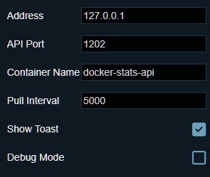
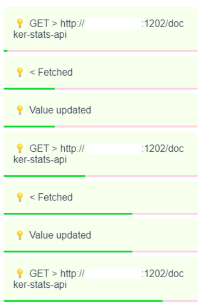

# WallpaperEngine : DockerStats 🐋📈

> ℹ️ [Logo.png](./documents/images/Logo.png) contains Docker and Wallpaper Engine's official logos.
> - Copyright © Docker Inc.
> - Copyright © Wallpaper Engine Team

Check your container's stats on the desktop!\
With `Wallpaper Engine` 😎
> ℹ️ If the repository you're watching now is a forked one, also check the [original repository](https://github.com/ForestHouse2316/WallpaperEngine-DockerStats) too!

## Getting started (User Guide) 😊


### Pull the image or build it manually 🖼️
> **Note that only `foresthouse2316/docker-stats-api` is the official image for now.**\
**DO NOT DOWNLOAD OR USE THAT FROM OTHER SITES OR UNKNOWN SOURCES ⚠️**\
It might harm your server and take permission about your docker.

#### Pull from Docker Hub 🐋
Download the API contianer image from docker hub.\
[Go to Docker Repository >](https://hub.docker.com/r/foresthouse2316/docker-stats-api)
```bash
docker pull foresthouse2316/docker-stats-api
```
This will pull ARM64 or AMD64 version according to your platform.

#### Build and create manually 🔧
If you can't even trust that image, you can make it for yourself.\
[This docker-stats-api folder](./docker-stats-api) has all files to build the container.\
Download the folder and execute this:
```bash
# Execute below in the folder 'docker-stats-api'
docker build -t docker-stats-api . --no-cache
```


### Create container with options 🔨

Now you can create the container from that image we just pulled(or built).
```bash
docker run -d -p 1202:1202 -v /var/run/docker.sock:/var/run/docker.sock --name docker-stats-api docker-stats-api
```

There are some options you can set.\
You can set them with `-e` argument of docker command, and `-e` can be written multiple times.
```bash
docker run -d -p 1202:1202 -e ENV1="VAL1" -e ENV2="VAL2" -v /var/run/docker.sock:/var/run/docker.sock --name docker-stats-api 
```
|ENV Name|Value|Default|Description|
|:---:|:---:|:---:|:---|
|ALLOW_FETCH_ALL_CONTAINERS|boolean|false|If true, `http://IP_ADDRESS:1202/` will return all container stats.|
|EXCLUDES|comma_separated<br/>string|""|Hides containers whose name is in this list.<br/>Separate container names like `-e EXCLUDES="a,b,c,d"`.|
|SAVE_NETWORK_USAGE|**0**<br/>**1**(_compatible_)<br/>**2**(_extreme_)|0|**NOT IMPLEMENTED** ⚠️|


### Open firewall 🧱

The API port number is `1202` if you did not changed it when you start `docker-stats-api`.

Open your operating system's firewall.\
For example, in Ubuntu with `iptables`:

```bash
sudo iptables -A INPUT -p tcp --dport 1202 -j ACCEPT
```

Or you can change the priority of this rule to first if there's a problem.\
(Some IaaS set the ALL-BLOCKING rule in the VM's firewall rules)

```bash
sudo iptables -I INPUT 1 -p tcp --dport 1202 -j ACCEPT
```

If you are using IaaS (AWS, Oracle, Azure...), **open same port it in the cloud management window.**


### [Take a look at the wallpaper list](./documents/WallpaperRepos.md) and subscribe it on STEAM 📥
Choose the wallpapers you want.
[**Here**](./documents/WallpaperRepos.md)'s the list of repositories that made by using this repository.


### Type server information on WallpaperEngine 🖥️
Select the downloaded wallpaper in WallpaperEngine.
Then you will be able to see some options like this:



Input the server address, port number, and other information about your server to receive the docker stats data.


## Troubleshooting 🤯


### Modify access permission of the socket 🔑

If the container cannot access to your `docker.sock`, let's add the permission:
```bash
sudo chmod 660 /var/run/docker.sock # this is a default status of docker.sock

sudo chmod 666 /var/run/docker.sock # try this, and if works, add user to group 'docker'
```


### Ping to API Port 🏓
Try ping to the port or check the port's openness from outside of your server.

And, also check this checklist:
- Did you typed `iptables` command correctly?
- Is your rule for port `1202` (or your customised one) is preceding other rules like `REJECT 0.0.0.0`?
- Are you using IaaS? Is there any firewall system else?
- Is port already occupied to another process?


### Fetch timeout error on the low interval 🕑
Requesting stats data too quickly is a DDoS attack to your server.
If your API server cannot handle your pull interval, it will be result in timeout error on fetch method.
Then, you can find your server's minimum interval with **debug mode**.

Turn on `Show Toast` and `Debug Mode` options.
And adjust your interval when toast messages pop up like this:



When the toast messages following `GET > Fetched > Value Updated` sequence, you can use without timeout error.
But if order is not like that, it will cause a number of errors soon.

> ℹ️ Even if the toast messages following that sequence, timeout error may occur intermittently if your server or local computer is overloaded.


## [Make your own wallpaper (Developer Guide) ⚙️](./documents/DeveloperGuide.md)

Building the vue project, you'll be able to see **a roughly designed wallpaper**\
Yes, this is just a **BASEMENT** of a wallpaper.\
Add your own theme into this project and share it to others!\
You can request to register your wallpaper repository on [HERE➡️](./documents/WallpaperRepos.md) by making PR.

Click the title, and let's go to the **Developer Guide** 🌠
