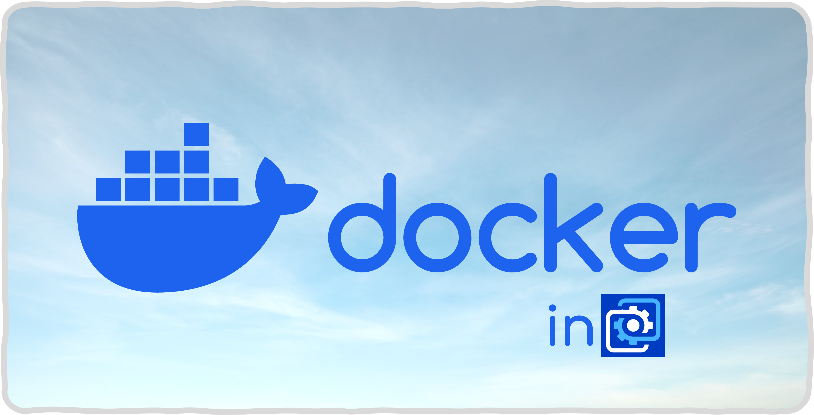

# WallpaperEngine : DockerStats 🐋📈

> [!note]
> [Logo.png](./documents/images/Logo.png) contains Docker and Wallpaper Engine's official logos.
> - Copyright © Docker Inc.
> - Copyright © Wallpaper Engine Team

Check your container's stats on the desktop!\
With `Wallpaper Engine` 😎

-----

## [> User Guide (Installation) 😊](./documents/UserGuide.md)

Set up the environment and get an awesome wallpaper displays your docker stats!

## [> List of registered wallpapers](./documents/WallpaperRepos.md) 🏞️

Here's the list of the wallpapers registered by PR.
Take a look, and pick it up what you want!
> [!important]
> This list is either an official wallpaper list nor the list containing entire wallpapers made with this wallpaper template.
> It's just a list of user-made contents.
> There's no official wallpaper except `DockerStats: Basic Edition`, ~~which is only for development :)~~

## [> Developer Guide ⚙️](./documents/DeveloperGuide.md)

Building the vue project, you'll be able to see **a roughly designed wallpaper**\
Yes, this is just a **BASEMENT** of a wallpaper.\
Add your own theme into this project and share it to others!\
You can request to register your wallpaper repository on [HERE➡️](./documents/WallpaperRepos.md) by making PR.

Click the title, and let's go to the **Developer Guide** 🌠

## License
### This repository
Custom license based on `MPL 2.0`.

### 3rd Party
|Name|License|
|:-:|:-:|
|Vue3|MIT|
