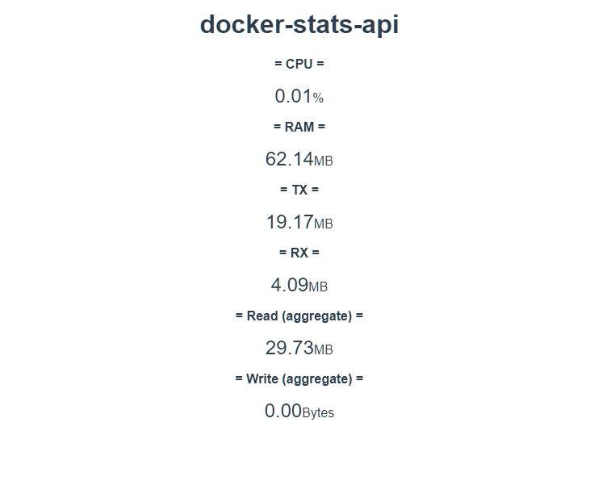

# Wallpaper Repositories
> [!note]
> Anyone can make pull requests to register their wallpaper repository on here.
Just add your one at the end of the list, and make PR!

<table>
  <tr>
    <th>Screenshot</th>
    <th>Repository</th>
    <th>Description</th>
  </tr>
  <tr>
    <td></td>
    <td><a href="https://github.com/ForestHouse2316/WallpaperEngine-DockerStats">Snowman Wallpaper</a></td>
    <td>This is the example! Upload your awesome Wallpapers 😎 
        Please restrict your image size with <i><b>height: 150px</b></i> option. 
        There's no specific length limit for description, but please write it within twice the size of image.
    </td>
  </tr>
</table>

> [!warning]
> Registering wallpapers does not mean it has gotten certificated or is safe.
> So, please, always check whether it can be trusted.
> **If you found the malicious one, please notice it to us by making an issue.**

> [!caution]
> Repetitively, whenever you use these wallpapers, **DO NOT USE `docker-stats-api` IMAGE FROM UNKOWN SOURCES**.
> Only this repository and `foresthouse2316/docker-stats-api` in the DockerHub is the original.

-----

<table>
  <tr>
    <th>Screenshot</th>
    <th>Repository</th>
    <th>Description</th>
  </tr>
  <tr>
    <td></td>
    <td><a href="https://github.com/ForestHouse2316/WallpaperEngine-DockerStats">DockerStats: Basic Edition</a></td>
    <td>Just <b>BASIC</b> 
        This is the wallpaper built from this repository.</td>
  </tr>
  <tr>
    <td></td>
    <td><a href="https://github.com/GanyuLover/WallpaperEngine-DockerStats-Ganyu">DockerStats: Ganyu Edition</a> 
      (<i>Currently not available, because this account has tagged as "spammy".</i>😥) 
      <a href="https://steamcommunity.com/sharedfiles/filedetails/?id=3489737351">Visit SteamWorkshop ></a></td>
    <td><b>Ganyu</b> with galze lily. 
        Including sliding stats screen!</td>
  </tr>
</table>
